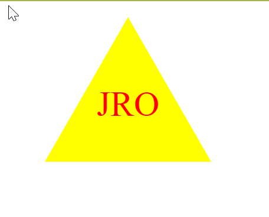
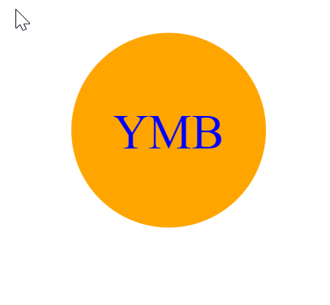
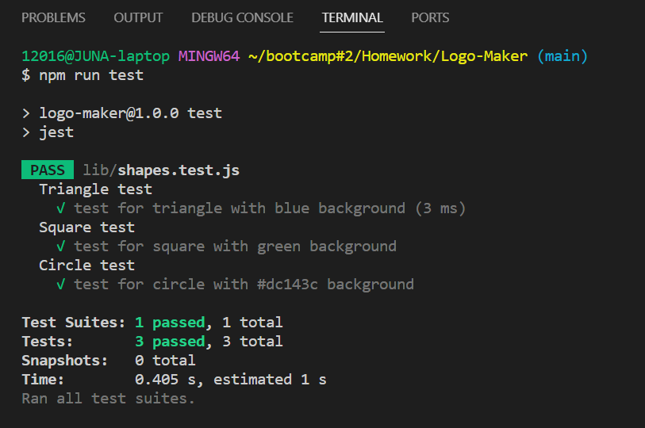

# Logo-Maker

## Table of Contents
  - [Description](#Description)
  - [Installation](#Installation)
  - [Usage](#Usage)
  - [Link](#link)
  - [License](#License)
  - [Credits](#Credits)
  - [Tests](#Tests)
  - [Questions](#Questions)

  ## Description
  This application was built for users to generate simple SVG file logos, after prompting users to select a color, shape, and provide text for the logo. For developers, it can reduce the usage of graphic designers, and save on time and money.

  ## Installation
  To install, first clone this repo: git clone https://github.com/juna-2017/Logo-Maker, and then open it in VS Code. Using the terminal, you need to make sure to have [**Node.js**](https://nodejs.org/en/download) installed then once that is installed, utilize command `npm init -y` to create a package.json. Then you need to run command `npm i` to install the dependencies needed with this application, which are [*Inquirer*](https://www.npmjs.com/package/inquirer) and [*Jest*](https://www.npmjs.com/package/jest).

  ## Usage
  To run this application, after all dependencies are installed, type command `node index.js`. This will then prompt you through a series of questions regarding how you want your logo to look. Once all questions are answered properly, your logo will then be generated which you can find in the newly generated SVG file.

  Here are some examples of logos that were generated

  

  
  
  
  ## Link 
  Here is a **video link** to see the functionality of this logo-maker: [Watch Me!](https://drive.google.com/file/d/1eO18ax2npjp3QQwwBbIJ_Y3PX9MbgE3n/view)

  ## Credits 
  This assignment was worked with tutor Thomas Gilmore who assisted in getting it started, and helped in getting the unit testings to pass.
  

  ## Tests
  To run unit testing, run command `npm run test` in the terminal. There is currently 1 test suite with three tests, which are checking for a render() method that returns a string for the corresponding SVG file with the given shape color.

  The test suite for this application shows all three tests passing.

  

  ## Questions
   Here's a link to my GitHub: [juna-2017](https://github.com/juna-2017)

   You can reach me at: juna.okon@gmail.com
